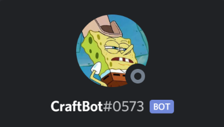

<!---
<div align="center"></div>
-->

<pre align="center" style="background-color:royalblue"><code style="color:lavenderblush"> ________  ________  ________  ________ _________  ________  ________  _________   
|\   ____\|\   __  \|\   __  \|\  _____\\___   ___\\   __  \|\   __  \|\___   ___\ 
\ \  \___|\ \  \|\  \ \  \|\  \ \  \__/\|___ \  \_\ \  \_\  \ \  \|\  \|___ \  \_| 
 \ \  \    \ \   _  _\ \   __  \ \   __\    \ \  \ \ \   __  \ \  \ \  \   \ \  \  
  \ \  \____\ \  \\  \\ \  \ \  \ \  \_|     \ \  \ \ \  \_\  \ \  \_\  \   \ \  \ 
   \ \_______\ \__\\ _\\ \__\ \__\ \__\       \ \__\ \ \_______\ \_______\   \ \__\
    \|_______|\|__|\|__|\|__|\|__|\|__|        \|__|  \|_______|\|_______|    \|__|
</code></pre>

<p align="center">CraftBot is a Discord bot created for the OG Craftbois private Discord server.<br>Its continuing mission: to seek out games to play together, helping us spend less time deciding, and more time doing.</p>

## Table of contents

- [Why Does CraftBot Exist?](#why-does-craftbot-exist?)
- [How Does It Work?](#how-does-it-work?)
    - [Overview](#overview)
    - [Under The Hood](#under-the-hood)
- [Additional Features](#additional-features)

# Why Does CraftBot Exist?

Over time, my group of close friends has become scattered across the country, and our weekly gaming sessions have become our only means of spending time together. The only problem being, we spent almost as much time deciding on a game as we did actually playing one. We weren't sure what games we all owned, and we're all pretty indecisive.

<h3 align="center"><b><i>Enter: CraftBot.</i></b></h3>

<div align="center"></div>

# How Does It Work?

## Overview

CraftBot randomly chooses a game that the users in OG Craftbois' voice channel have in common, or lists them if the -l (list) flag is set:

<p align="center" style="color:red"><i>Insert joining/leaving rabble gif here</i></p>

This behavior can be modified using the -c (choose) flag, which directs CraftBot to find games in common for the chosen users, or for all users if no users are specified:

<div align="center"></div>

## Under The Hood

On startup, CraftBot interfaces with the Steam API to compile the "master list", a list of every single game owned by at least one of us, with each game having an associated list of owners. The master list can also be updated at any time using a console command.

`steam_tools.js updateMaster()`:

```js 
function buildMasterList() {
    gamesLists.each((list, username) => {
        for (const game of list) {
            if (masterList.has(game)) { // Game in master list
                // Add username to master list game entry
                masterList.get(game).push(username);
            } else {
                // Add game entry to master list
                masterList.set(game, [username]);
            }
        }
    });
    console.log('Master list updated.');
    resolve();
}

// HTTP Requests Here
```

In our use case, everyone who will be participating in a gaming session will also be present in the server's voice channel. As such, the voice channel serves as a list of "active users", effectively filtering out anyone who may be online, but not participating.

When a user joins or leaves the voice channel, CraftBot updates the list of active users: a list of usernames and Steam IDs.

`index.js`:

```js 
client.on('voiceStateUpdate', (oldState, newState) => {
    // Only trigger on joining/leaving voice channel
    if (oldState.channel === newState.channel) return;

    // Update client.activeUsers
    tools.updateActiveUsers(client);

    // Update client.sharedList
    steamTools.updateSharedActive(client);
});
```

`tools.js`:

```js 
updateActiveUsers: (client) => {
    // Get active user channel (defined in config.json)
    const activeUserChannel = client.server.channels.cache.find(channel => channel.name === voiceChannel);
    var activeUsers = [];
    
    // Get usernames of members in voice channel
    activeUserChannel.members.array().forEach(member => {
        activeUsers.push(member.user.username);
    });
            
    // Set client.activeUsers
    client.activeUsers = client.steamUsers.filter((ID, username) => {
        return activeUsers.includes(username);
    });
}
```

CraftBot then compiles a list of shared games by filtering the master list down to only entries owned by all active users.

`steam_tools.js`:

```js 
updateSharedActive: client => {
    /*
    If no active users, set client.sharedList to blank collection
    */
    if (!client.activeUsers.size) {
        return client.sharedList = new Discord.Collection();
    }
    /*
    For each item in master list, add to shared list only if owners array
    contains all users present in client.activeUsers
    */
    client.sharedList = client.masterList.filter(owners => {
        var isShared = true;
        client.activeUsers.each((ID, user) => {
            if (!owners.includes(user)) {
                isShared = false;
            }
        });
        return isShared;
    });
}
```

If the -c flag is set in a call to !steam (e.g. "!steam -lc @user1 @user2"), CraftBot ignores the active user list, and compiles a temporary list using only the mentioned users, or, if no users are mentioned, using all known server members.

`steam_tools.js`:

```js 
getChosenShared: (client, mentions) => {
    var chosen;

    // If no mentions, use all CraftBois
    if (!mentions.length) {
        chosen = client.steamUsers;
    }
    else chosen = client.steamUsers.filter((ID, username) => {
        return mentions.includes(username);
    });

    // Return list of shared games
    return client.masterList.filter(owners => {
        var isShared = true;
        chosen.each((ID, user) => {
            if (!owners.includes(user)) {
                isShared = false;
            }
        });
        return isShared;
    });
}
```

# Additional Features

## Console Commands

CraftBot has a console command handler built in, allowing back-end commands to be executed.

Currently, the only commands implemented are `say`, which sends a message as CraftBot in the specified channel (or in #general if no channel is specified), and `mupdate`, which updates the master list.

## Dynamic Help Command

CraftBot contains a dynamic help command, which, when executed with no arguments, sends a list of available commands, and when executed with a command name as an argument, sends information on how to use that command.

`!help`:

```
Here's a list of all my commands:
    avatar, help, kick, server, squid, steam

Use '!help <command>' to get info on a specific command!
```

`!help steam`:

```
!steam: Interfaces with members' steam libraries


Usage: "!steam [-c]"             : picks a shared steam game at random
       "!steam -l[c]"            : lists shared steam games
       "!steam -i <@user> <ID>"  : adds or updates mention's steam ID


Flags: -c [<@user1> ...]: Choose users. If no users mentioned, use all Craftbois.
       -l : List shared games.

Cooldown: 1 seconds
```

## Dynamic Command Reloading

<p align="center" style="color:red"><i>Insert command reloading gif here</i><p>

CraftBot is designed to detect when a command file has been modified, and reload that command back into itself, allowing quick changes to commands without the need to restart CraftBot.

## Command Cooldown System

<div align="center"></div>
</br>

CraftBot utilizes a cooldown system to prevent commands from being spammed. The cooldowns are per-command, per-user, i.e., a cooldown on `!squid` for user 1 doesn't prevent user 2 from using it, and user 1 is still able to use other commands.

## Other Commands

<h3><b>Kick User:</b></h3>

`!kick @user` kicks the mentioned user.


<h3><b>Server Information:</b></h3>

`!server`:

```
Server: OG Craftbois
Craftboi Count: 6
Established: Sat Jan 06 2018 19:58:42 GMT-0500 (Eastern Standard Time)
Region: us-south
```

<h3><b>Squid Printing Functionality:</b></h3>

Following years of research, CraftBot is now able to print squids with unprecedented accuracy.

`!squid`:

```
        .--'''''''''--.
     .'      .---.      '.
    /    .-----------.    \
   /        .-----.        \
   |       .-.   .-.       |
   |      /   \ /   \      |
    \    | .-. | .-. |    /
     '-._| | | | | | |_.-'
         | '-' | '-' |
          \___/ \___/
       _.-'  /   \  `-._
     .' _.--|     |--._ '.
     ' _...-|     |-..._ '
            |     |
            '.___.'
              | |
             _| |_
            /\( )/\
           /  ` '  \
          | |     | |
          '-'     '-'
          | |     | |
          | |     | |
          | |-----| |
       .`/  |     | |/`.
       |    |     |    |
       '._.'| .-. |'._.'
             \ | /
             | | |
             | | |
             | | |
            /| | |\
          .'_| | |_`.
          `. | | | .'
       .    /  |  \    .
      /o`.-'  / \  `-.`o\
     /o  o\ .'   `. /o  o\
     `.___.'       `.___.'
```

<h3><b>Get User Avatar:</b></h3>

`!avatar` returns a direct link to the user's avatar.

`!avatar @user` returns a direct link to the mentioned user's avatar.

## Dirty Dan Regex

<div align="center"></div>
</br>

CraftBot never gets tired of the classic "who's Dirty Dan" argument, as CraftBot is a machine and never gets tired of anything. It uses a simple regex, `/.*i(s|'m|.*am).*dirt(y|iest).*dan.*/`, to catch anyone claiming to be Bikini Bottom's most notorious criminal, and quickly corrects them.

## JSON Files

Critical information is stored in JSON files, `config.json` and `steam.json`, for easy access and modification. Example versions of these files can be found in this repository.